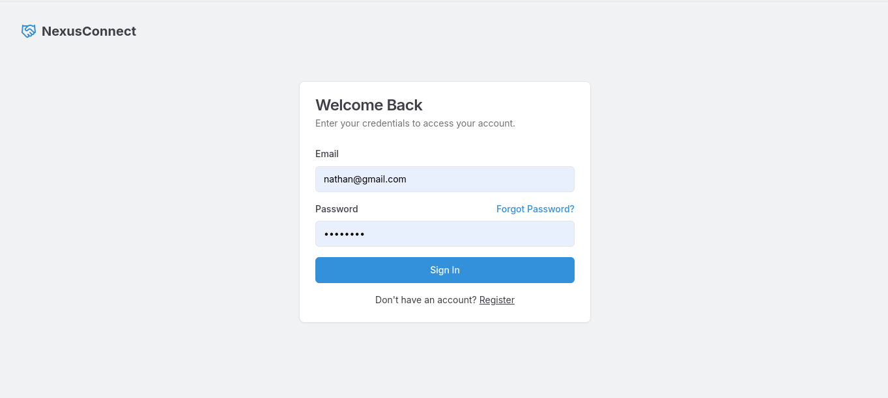
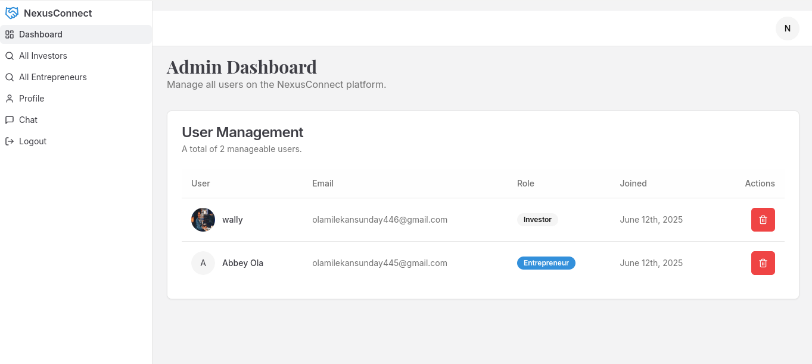
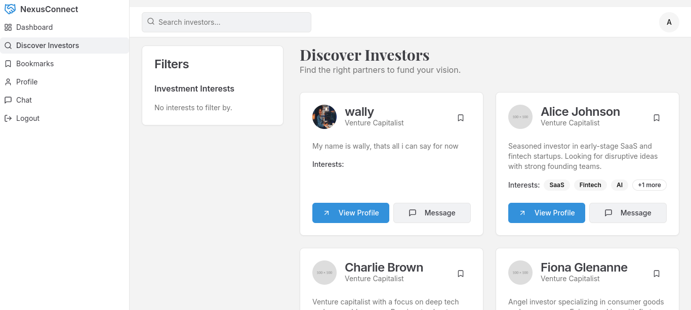
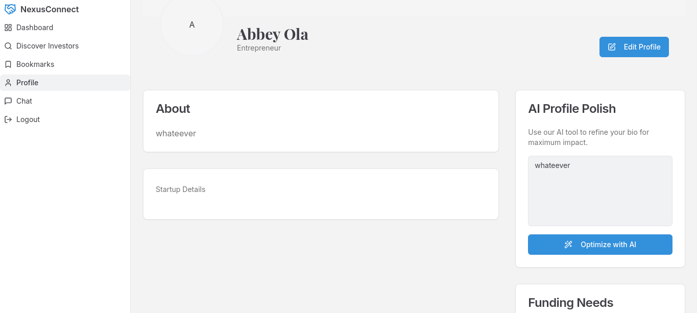

# NexusConnect

NexusConnect is a dynamic, full-stack platform designed to bridge the gap between innovative entrepreneurs and strategic investors. It provides a seamless environment for networking, collaboration, and growth, powered by modern web technologies and artificial intelligence.

## ✨ Key Features

- **Dual User Roles**: Separate, tailored experiences for **Investors** and **Entrepreneurs**.
- **Secure Authentication**: Complete auth flow including registration, login, and password reset using JWT.
- **Guided Onboarding**: A streamlined process for new users to complete their profiles upon their first login, ensuring a high rate of profile completion.
- **Role-Based Dashboards**: At-a-glance overview of relevant activities, requests, and analytics.
- **Advanced Profile Discovery**:
  - Search for users by name or keywords.
  - Filter investors by specific `investmentInterests`.
- **Comprehensive Profile Management**:
  - Users can view and edit their profiles, including bio, startup details, and investment interests.
  - Direct avatar uploads from the user's device.
- **Collaboration System**: Investors can send collaboration requests, and entrepreneurs can accept or reject them.
- **Direct Messaging**: A built-in chat system allows for real-time communication between users.
- **Profile Bookmarking**: Users can save interesting profiles to a personal "Bookmarks" page for easy access later.
- **Admin Panel**: A dedicated dashboard for administrators to view and manage all users on the platform.
- **Email Notifications**: Automated emails for key events like accepted collaboration requests, new messages, and password resets, powered by Resend.

---

## 🛠️ Tech Stack

- **Framework**: [Next.js](https://nextjs.org/) (App Router)
- **Language**: [TypeScript](https://www.typescriptlang.org/)
- **Styling**: [Tailwind CSS](https://tailwindcss.com/)
- **UI Components**: [ShadCN UI](https://ui.shadcn.com/)
- **Database**: [MongoDB](https://www.mongodb.com/) with [Mongoose](https://mongoosejs.com/)
- **Authentication**: [JWT](https://jwt.io/), [bcrypt.js](https://github.com/dcodeIO/bcrypt.js)
- **Form Management**: [React Hook Form](https://react-hook-form.com/) & [Zod](https://zod.dev/)
- **Email Service**: [Resend](https://resend.com/)

---

## 🚀 Getting Started

Follow these instructions to get a copy of the project up and running on your local machine for development and testing purposes.

### Prerequisites

- [Node.js](https://nodejs.org/) (v18 or later recommended)
- [MongoDB](https://www.mongodb.com/try/download/community) instance (local or a cloud service like MongoDB Atlas)

### Installation & Setup

1.  **Clone the repository:**
    ```bash
    git clone <your-repository-url>
    cd NexusConnect
    ```

2.  **Install dependencies:**
    ```bash
    npm install
    ```

3.  **Set up environment variables:**
    Create a file named `.env` in the root of your project and add the following variables.

    ```env
    # MongoDB
    MONGODB_URI="your_mongodb_connection_string"
    MONGODB_DB_NAME="nexusconnect" # Or your preferred database name

    # JWT
    JWT_SECRET="your_super_secret_jwt_key_that_is_at_least_32_characters_long"

    # Resend (for email notifications)
    RESEND_API_KEY="your_resend_api_key"
    FROM_EMAIL="onboarding@resend.dev" # Or your verified Resend domain email

    # App URL
    NEXT_PUBLIC_APP_URL="http://localhost:9002"
    ```

    - `MONGODB_URI`: Your full connection string for your MongoDB database.
    - `JWT_SECRET`: A long, random, secret string used to sign JSON Web Tokens.
    - `RESEND_API_KEY`: Your API key from [Resend.com](https://resend.com) for sending emails.
    - `FROM_EMAIL`: The email address you've configured with Resend to send emails from.
    - `NEXT_PUBLIC_APP_URL`: The base URL of your application, used for creating links in emails.

4.  **Run the development server:**
    ```bash
    npm run dev
    ```

The application should now be running on [http://localhost:9002](http://localhost:9002).

---

## 📸 Screenshots


| Login Page                               | Admin Dashboard                     |
| ---------------------------------------- | ------------------------------------------ |
|  |  |

| Investor Discovery                           | Profile Page                               |
| -------------------------------------------- | ------------------------------------------ |
|  |    |


---

## 📄 License

This project is licensed under the MIT License - see the [LICENSE.md](LICENSE.md) file for details.
Abiodun (Abbey) Aina
olamilekansunday445@gmail.com
